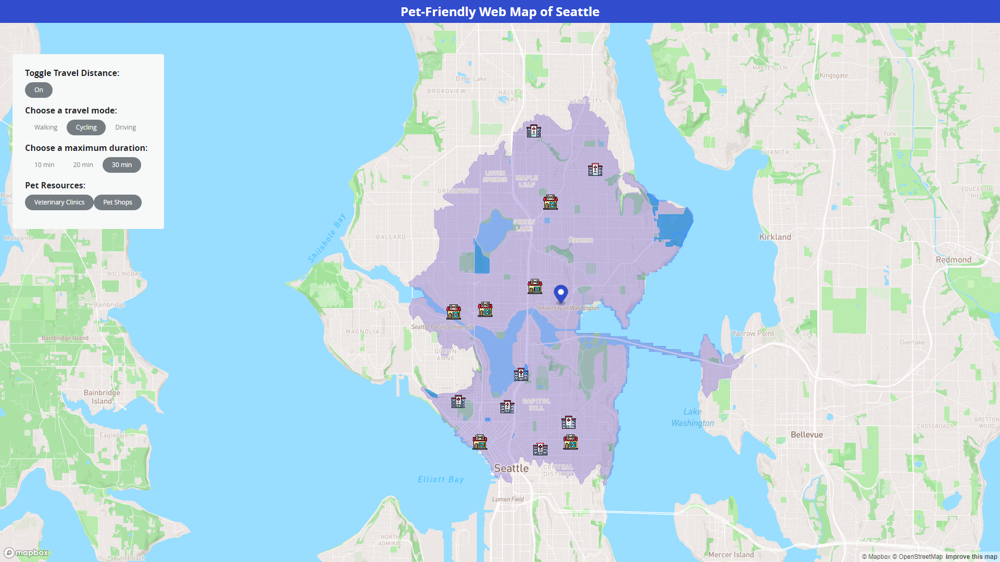

# Eli Lockard

[LinkedIn](https://www.linkedin.com/in/eli-lockard/)

[GitHub](https://github.com/ehl7)

# Summary

> I am currently a senior at the University of Washington majoring in Geography: Data Science.

# Projects

## Pet Friendly Web Map of Seattle

The [Pet Friendly Web Map of Seattle](https://risan03-2165658.github.io/geog328_pet_friendly/index.html) was created as a final group project for the Geography 328 Web GIS class at UW. This web GIS application can be used to help locate resources for pet owners within the Seattle area.

**Tools and technologies Used**
- HTML
- CSS
- Javascript
- Mapbox GL JS
- Turf.js